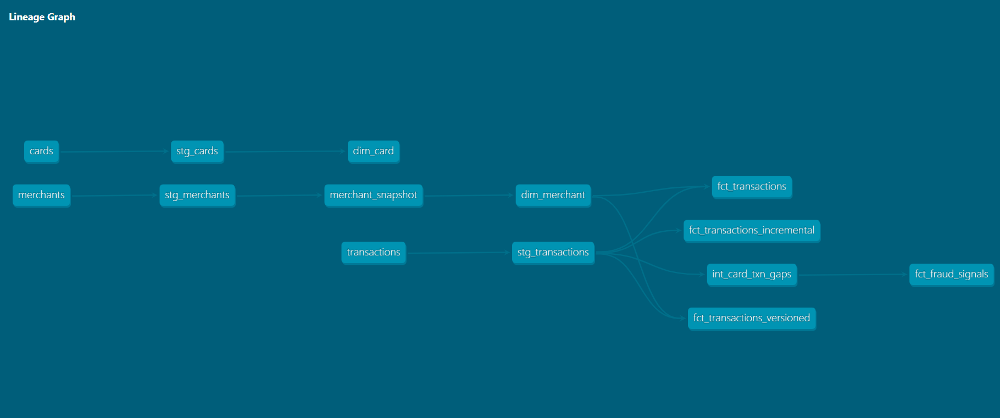

# pay-warehouse

A **dbt + Snowflake analytics-engineering project** modeling a payments / fraud-detection warehouse over synthetic transaction data. Built as a production-style ELT pipeline: layered transformations, dimensional modeling with slowly changing dimensions, incremental processing, data-quality testing, and CI that runs the full build + tests on every push.

> Theme: payments & fraud analytics — chosen to mirror real high-volume transaction systems (skewed merchant traffic, card-velocity fraud signals, evolving merchant attributes over time).

---

## Architecture



The warehouse follows a layered ELT pattern — **seeds → staging → intermediate → marts** — so each layer has a single responsibility and downstream models never touch raw data directly.

| Layer | Purpose | Materialization |
|-------|---------|-----------------|
| **Seeds** (`transactions`, `merchants`, `cards`) | Synthetic raw data (10k transactions, 500 cards, 150 merchants) | table (seed) |
| **Staging** (`stg_*`) | 1:1 cleanup of each source — rename, cast, normalize. A stable interface over raw. | view |
| **Intermediate** (`int_card_txn_gaps`) | Reusable multi-step logic — card-velocity gaps via window functions | view |
| **Marts** (`dim_*`, `fct_*`) | Dimensional model — facts + dimensions for analytics | table |
| **Snapshots** (`merchant_snapshot`) | SCD Type 2 history tracking for evolving merchant attributes | snapshot |

---

## Key features

**Dimensional modeling (star schema).** `fct_transactions` (events + measures) joins to `dim_merchant` / `dim_card` (descriptive context). Grain is declared explicitly: **one row per transaction** (atomic).

**Slowly Changing Dimensions — Type 2.** `merchant_snapshot` (dbt snapshot, `check` strategy on `category`) versions merchant attributes over time with auto-generated surrogate keys and validity windows. `fct_transactions_versioned` resolves each transaction to the merchant version that was valid **at transaction time** via a point-in-time join — so historical facts reflect historical truth.

**As-was vs as-is, modeled deliberately.** Two fact tables, by design:
- `fct_transactions` — labels transactions with each merchant's **current** attributes (default for merchant-id aggregations).
- `fct_transactions_versioned` — point-in-time labeling for when category-as-it-was matters.

**Incremental processing.** `fct_transactions_incremental` uses `materialized='incremental'` with a `merge` strategy on `transaction_id` and a high-water-mark filter (`is_incremental()` + `{{ this }}`). Each run processes **only new rows**, and the merge makes boundary-row overlap **idempotent** — re-runs and late data can't create duplicates. (Demonstrated: 10k full build → 3-row incremental run.)

**Fraud-signal analytics.** `fct_fraud_signals` flags `is_rapid_fire` (transactions <60s apart on the same card — a velocity signal computed with `LAG`) and `is_high_value`, surfacing the rare high-risk combination of both. The synthetic dataset has engineered velocity bursts and hot-merchant skew so these signals are real.

**Data-quality contracts.** Generic dbt tests across all layers — `unique` / `not_null` on keys, `accepted_values` on status enums, `relationships` (referential integrity) between facts and dimensions. 18 data tests enforced on every build.

**CI/CD.** GitHub Actions runs `dbt build` (all models + tests) against an **isolated `DBT_CI` schema** on every push and PR. Snowflake credentials are injected via **GitHub Secrets as environment variables** — never committed. CI caught a real SCD2 fan-out regression during development (see commit history).

---

## Tech stack

- **dbt Core** (1.11) + **dbt-snowflake** adapter
- **Snowflake** (warehouse + compute)
- **GitHub Actions** (CI)
- Layered ELT, dimensional modeling, SCD2, incremental materialization

---

## Project structure

```
models/
  staging/        stg_transactions, stg_merchants, stg_cards  (+ tests)
  intermediate/   int_card_txn_gaps
  marts/          dim_merchant, dim_card,
                  fct_transactions, fct_transactions_versioned,
                  fct_transactions_incremental, fct_fraud_signals  (+ tests)
snapshots/        merchant_snapshot                 (SCD2)
seeds/            transactions.csv, merchants.csv, cards.csv
.github/workflows/ci.yml                            (CI pipeline)
```

---

## Running locally

```bash
# 1. Install
pip install dbt-snowflake

# 2. Configure ~/.dbt/profiles.yml with your Snowflake connection (target: dev)

# 3. Load seeds, build models, run tests
dbt seed
dbt snapshot
dbt build          # runs models + tests in DAG order

# 4. Browse docs + lineage
dbt docs generate && dbt docs serve
```

---

## Design decisions worth noting

- **Staging as a shock absorber** — source schema changes are fixed in one staging model; marts stay untouched.
- **Surrogate keys for SCD2** — the fact carries a cheap equality-join key instead of an expensive, boundary-fragile range join on every read.
- **Incremental only where it earns it** — small dims stay full-rebuild (simpler, always correct); the large fact goes incremental (cheap deltas). Premature incrementalization is avoided.
- **CI builds into a throwaway schema** — unreviewed code on a PR can never overwrite production tables.

---

*Synthetic data only. Built as a portfolio project to demonstrate production analytics-engineering patterns.*
